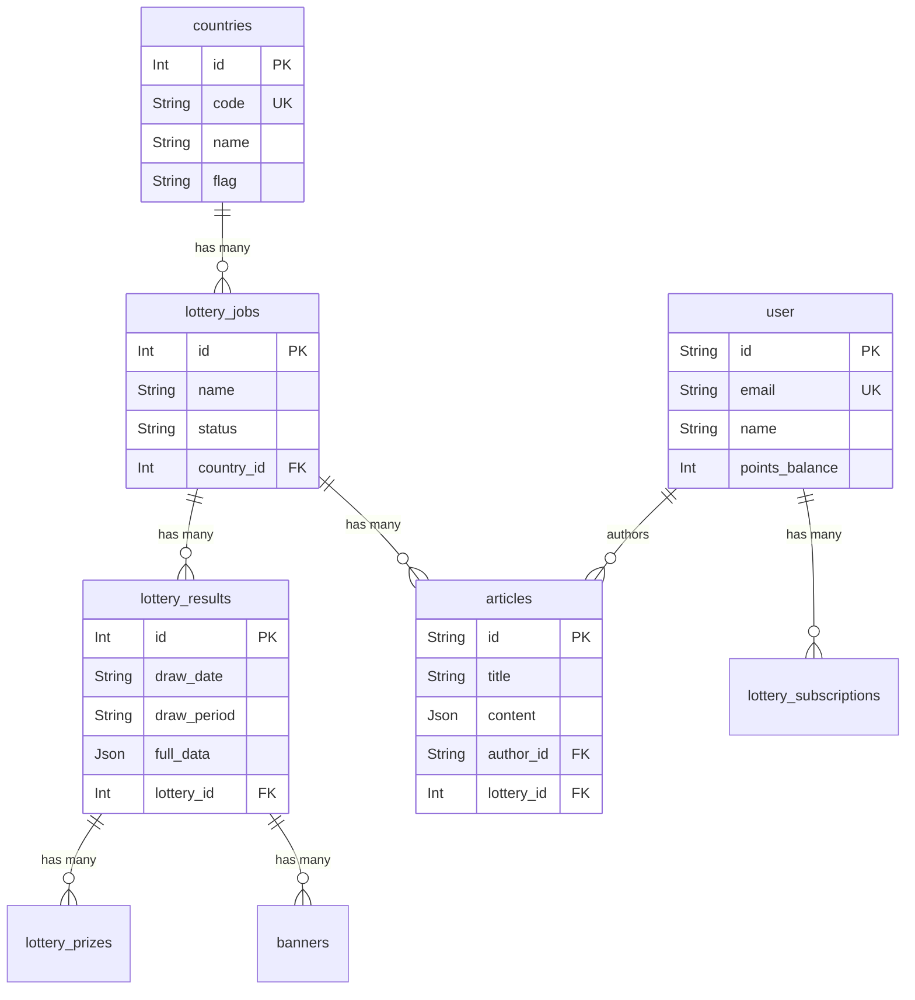

# โครงสร้างฐานข้อมูลและการนำไปใช้ใน UI (Database & UI Mapping)

เอกสารฉบับนี้อธิบายโครงสร้างฐานข้อมูล PostgreSQL ปัจจุบันของโปรเจกต์ Lotto-X และการนำข้อมูลเหล่านั้นไปแสดงผลในแต่ละหน้า (UI Mapping) เพื่อให้เห็นภาพรวมของ Data Flow ตั้งแต่ Database จนถึง Client (Browser)

---

## 1. โครงสร้างฐานข้อมูลหลักและความเกี่ยวข้อง (Core Database Schema & Relationships)

ฐานข้อมูลของระบบถูกออกแบบด้วย Prisma โดยมี Table หลักที่เกี่ยวข้องกับการทำงานดังนี้

1. **`countries`**:
   - เก็บข้อมูลประเทศ เช่น รหัส (`code`), ชื่อ (`name`), สัญลักษณ์ (`flag`)
   - **ความสัมพันธ์**: หนึ่งประเทศสามารถมีหวยได้หลายชนิด (One-to-Many กับ `lottery_jobs`)

2. **`lottery_jobs`**:
   - เป็นตารางสำหรับเก็บข้อมูลกำหนดการ (Cronjobs) และดึงข้อมูลหวยแต่ละประเภท
   - ไม่ได้มีความหมายเป็นข้อมูลตัวหวยโดยตรง (เมื่อข้อมูลถูกดึงมาแล้วจะไปเก็บในตาราง Result และ Prize)
   - **ความสัมพันธ์**: มี Foreign Key `country_id` ผูกกับ `countries`

3. **`lottery_results`**:
   - ตารางเก็บงวด "ผลการออกรางวัล" หลัก
   - ประจำด้วยวันที่ออกรางวัล (`draw_date`, `draw_period`) และสามารถมีข้อมูลดิบได้ใน `full_data`
   - **ความสัมพันธ์**: เป็นตัวตั้งต้นที่เชื่อมรางวัลก้อนหลักไปยัง `lottery_prizes`

4. **`lottery_prizes`**:
   - ตารางเก็บรวบรวม "รางวัลแต่ละประเภท" ของงวดนั้นๆ โดยเฉพาะ 
   - แบ่งเป็นหมวดหมู่ (`category`, `prize_name`) และตัวเลขรางวัล (`winning_numbers`)

5. **`banners`**:
   - เก็บข้อมูลเนื้อหารูปภาพที่จะนำไปทำสไลด์ หรือแบนเนอร์ต่างๆ ในหน้าโฮมเพจ (Home Page Slides)
   - **ความสัมพันธ์**: เชื่อมกลับไปหา `lottery_results` ได้ผ่าน `lottery_result_id` เพื่อใช้โชว์ผลรางวัลที่เกี่ยวข้องบนสไลด์

6. **`articles`**:
   - ตารางเก็บข่าวสารและบทความต่างๆ (Title, Content, Images, Category) 

7. **`user` และ ระบบ Authentication**:
   - เก็บข้อมูลบัญชีผู้ใช้งาน, คะแนน (points_balance), การจัดการ Session ต่างๆ (ทำงานร่วมกับ `session`, `account`)

---

## 2. การนำข้อมูลไปใช้งานกับ UI ในแต่ละหน้า (Page-by-Page Data Mapping)

### 2.1 หน้าแรก (Home Page: `/`)
- **ส่วน Hero Section & Background**: ก่อนหน้านี้ใช้ข้อมูลคงที่ (Static UI) แต่สามารถดึงข้อมูลสไลด์และรูปภาพมาจากตาราง **`banners`** แทนได้
- **แถบเลือกประเทศ (Country Tabs)**: ปัจจุบันเป็นการใช้ข้อมูลจำลอง (Mock Data) ข้อมูลธงชาติถูกดึงจาก Local Helpers (`getFlagUrl`)
- **ตารางผลรางวัลล่าสุด (Results Table)**: 
  - เมื่อผู้ใช้เข้าชมหน้าเว็บ Client Component จะเรียก `useApi('/api/results/latest')`
  - **API Behind the scenes**: API นี้จะดึงข้อมูลผ่าน Prisma โดยคิวรีตาราง `lottery_results` จัดเรียงตามวันที่ล่าสุดแบบภาพรวม จำกัด 10 ผลลัพธ์ล่าสุดเท่านั้น
- **ส่วนรายชื่อประเทศ (Country List Section)**:
  - ใช้ Component `CountryListSection` ซึ่งสามารถดึงรายชื่อประเทศและนับจำนวนรอบหวยจากตาราง `countries` (ผ่าน `/api/countries`)

### 2.2 หน้าเลือกรอบหวยของแต่ละประเทศ (Country Page: `/[country]`)
- หน้านี้เป็น Server Component ระดับเลย์เอาต์ ปัจจุบันมีการใช้ข้อมูลแบบผสม:
  - **ข้อมูลรายชื่อหวยและแจ็คพอต (Lotteries List)**: ปัจจุบันใช้ **Mock Data** (`COUNTRY_DATA` ภายในไฟล์ `page.tsx`) ในการบอกว่าประเทศนี้มีตารางหวยอะไรบ้าง (เช่น Thai Lotto, Powerball) 
  *(อนาคตสามารถปรับให้คิวรีจากตาราง `countries` join เข้า `lottery_jobs` เพื่อนำมาแสดงแบบ Dynamic ได้)*

### 2.3 หน้ารายละเอียดผลหวย (Lottery Detail Page: `/[country]/[lottery]`)
- **ส่วนข้อมูล Metadata แบบ SEO**: ดึงชื่อจาก Config จำลอง (เช่น `LOTTERY_CONFIG`) ในไฟล์ Server Component
- **ส่วนหน้าตาแสดงผลผลรางวัล (LotteryDetail Component)**:
  - ตัว Component จะเรียก API เบื้องหลังด้วยคำสั่ง: `useApi('/api/results/[ประเภทหวย]?limit=10')` เช่น `/api/results/thai`
  - **API Behind the scenes**: `/api/results/[type]` จะทำงานบน `ApiClient` ซึ่งใช้ Prisma คิวรีตาราง `lottery_results` โดยกรองจากชื่อประเภทของหวยในตาราง `lottery_jobs` (`name === 'thai'`)
  - **การจัดการ UI**: 
    - ข้อมูลตาราง JSON ในเขตข้อมูล `full_data` ของตาราง `lottery_results` จะถูกแกะออกมา
    - ถูกนำมา Map ลงใน Component `DrawResult` เช่น รางวัลที่ 1 (`firstPrize`), เลขหน้า 3 ตัว (`last3f` ส่งให้ `front3`), เลขท้าย 3 ตัว (`last3b` ส่งให้ `back3`), และรางวัลย่อยอื่นๆ
    - ประวัติหวยย้อนหลัง (History) จะถูกวนลูป (Map) แสดงรายการอยู่ด้านล่างโดยอิงจาก `history` ที่ API ตอบกลับมา

### 2.4 หน้าข่าวสาร (News Page: `/news`)
- **การคิวรีข้อมูล (Fetching)**: Client Component เรียก `useApi('/api/news?lang=...&limit=20&search=...')`
- **API Behind the scenes**: จะคิวรีข้อมูลข่าวสารทั้งหมดในตาราง `articles` ผ่าน Prisma (รวมระบบ Paging และ Search Filter จาก Database โดยตรง)
- **Fallback**: หาก API โหลดไม่ผ่านระบบจะมีชุดข้อมูลสำรอง Local (`fallbackNewsArticles`) เผื่อนำมาโชว์แทนชั่วคราว

### 2.5 หน้าสถิติย้อนหลังและอื่นๆ (Global Draws: `/global-draws`, `/results`)
- หน้าเหล่านี้ใช้ API ดึงรายละเอียด (เช่น `/api/results/global`) จากตาราง `lottery_results` เป็นหลัก
- ตารางผลสามารถฟิลเตอร์แยกตามวันที่แบบเจาะจงได้ โดยคิวรีจากฟิลด์ `draw_date`

---

## สรุป (Conclusion & Potential Improvements)
โครงสร้างโดยรวมมีความแข็งแรง แต่มีบางส่วนที่ยังใช้ **Mock Data (ข้อมูลจำลอง)** เช่น "หน้าเลือกหวยระดับประเทศ (`/[country]`)" หรือ "รายการแถบ Tab หน้าจอ (Tabs) หน้า Home" ซึ่งในอนาคต หากต้องการให้ Dynamic สมบูรณ์ สามารถเขียน Service/API ดึงลิสต์ของประเทศและประเภทหวยจากตาราง `countries` และ `lottery_jobs` ขึ้นมา Render ได้ทันทีแบบไม่ต้องอิงค่าคงที่ (Hardcode) ครับ

> **สำหรับ User:** ช่วยรีวิวได้เลยครับว่าความเข้าใจในภาพรวมถูกต้องตามที่คุณต้องการหรือไม่ ถ้ามีส่วนใดเข้าใจผิด สามารถแจ้งให้ช่วยปรับแก้ได้เลยครับ!
