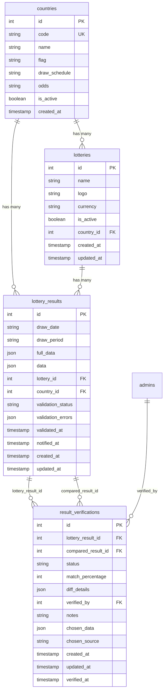
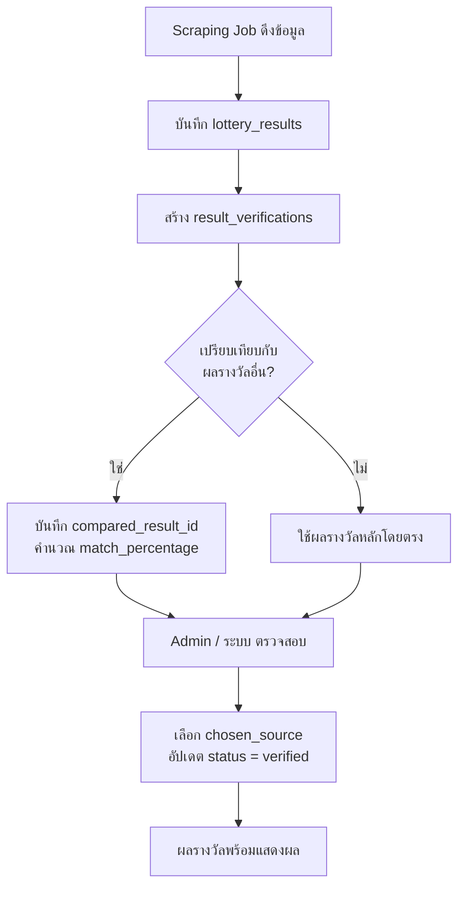

# Database Detail - Lottery Tables

เอกสารนี้อธิบายโครงสร้างและข้อมูลของตาราง `countries`, `lotteries`, และ `result_verifications` ซึ่งเป็นตารางหลักสำหรับระบบ Lottery

> อัปเดตล่าสุด: 2026-02-27

---

## ER Diagram (ความสัมพันธ์ระหว่างตาราง)



---

## 1. ตาราง `countries`

### คำอธิบาย
เก็บข้อมูลประเทศที่มีหวย (Lottery) ในระบบ ทำหน้าที่เป็นตาราง Master สำหรับจัดกลุ่มหวยตามประเทศ

### โครงสร้างคอลัมน์

| คอลัมน์ | ชนิดข้อมูล | Nullable | Default | คำอธิบาย |
|---|---|---|---|---|
| `id` | Integer | NO | autoincrement | Primary Key |
| `code` | String | NO | - | รหัสประเทศ (Unique) เช่น `th`, `la`, `vn` |
| `name` | String | NO | - | ชื่อประเทศภาษาอังกฤษ |
| `flag` | String | YES | - | URL ของรูปธงชาติ |
| `draw_schedule` | String | YES | - | ตารางการออกรางวัล |
| `odds` | String | YES | - | อัตราเดิมพัน |
| `is_active` | Boolean | YES | `true` | สถานะใช้งาน |
| `created_at` | Timestamp | YES | `now()` | วันที่สร้าง |

### ความสัมพันธ์
- **Has Many** `lotteries` -- ประเทศหนึ่งมีหวยได้หลายชนิด
- **Has Many** `lottery_results` -- ประเทศหนึ่งมีผลรางวัลได้หลายรายการ

### Indexes
- `countries_code_unique` -- Unique index บน `code`

### ข้อมูลปัจจุบัน (3 รายการ)

| id | code | name | flag | draw_schedule | odds | is_active | created_at |
|---|---|---|---|---|---|---|---|
| 1 | `th` | Thailand | `https://flagcdn.com/w80/th.png` | (ว่าง) | (ว่าง) | true | 2026-02-23 |
| 2 | `la` | Laos | `https://flagcdn.com/w80/la.png` | (ว่าง) | (ว่าง) | true | 2026-02-25 |
| 3 | `vn` | Vietnam | `https://flagcdn.com/w80/vn.png` | (ว่าง) | (ว่าง) | true | 2026-02-25 |

---

## 2. ตาราง `lotteries`

### คำอธิบาย
เก็บข้อมูลประเภทหวยแต่ละชนิดที่ระบบรองรับ แต่ละหวยจะสังกัดอยู่ในประเทศใดประเทศหนึ่ง

### โครงสร้างคอลัมน์

| คอลัมน์ | ชนิดข้อมูล | Nullable | Default | คำอธิบาย |
|---|---|---|---|---|
| `id` | Integer | NO | autoincrement | Primary Key |
| `name` | String | NO | - | ชื่อหวย เช่น "Government Lottery Office (GLO)" |
| `logo` | String | YES | - | URL โลโก้ของหวย (R2 Storage) |
| `currency` | String | YES | `THB` | สกุลเงิน |
| `is_active` | Boolean | YES | `true` | สถานะใช้งาน |
| `country_id` | Integer | YES | - | FK ไปยัง `countries.id` |
| `created_at` | Timestamp | YES | `now()` | วันที่สร้าง |
| `updated_at` | Timestamp | YES | - | วันที่อัปเดตล่าสุด |

### ความสัมพันธ์
- **Belongs To** `countries` -- ผ่าน `country_id` -> `countries.id`
- **Has Many** `lottery_results` -- หวยหนึ่งชนิดมีผลรางวัลได้หลายรายการ
- **Has Many** `lottery_jobs` -- มี scraping jobs
- **Has Many** `articles` -- มีบทความที่เกี่ยวข้อง
- **Has Many** `lottery_subscriptions` -- มีผู้ติดตาม

### Foreign Keys
- `lotteries_country_id_countries_id_fk` -- `country_id` -> `countries.id` (ON DELETE: NoAction)

### ข้อมูลปัจจุบัน (2 รายการ)

| id | name | logo | currency | is_active | country_id | result_count |
|---|---|---|---|---|---|---|
| 1 | Government Lottery Office (GLO) | `.../a8c1e842...svg` | THB | true | 1 (Thailand) | 455 |
| 5 | Lao Development | `.../9f0183fb...png` | THB | true | 2 (Laos) | 304 |

> **หมายเหตุ:** ยังไม่มี lottery สำหรับประเทศ Vietnam (country_id = 3)

---

## 3. ตาราง `result_verifications`

### คำอธิบาย
เก็บข้อมูลการตรวจสอบความถูกต้องของผลรางวัลหวย ใช้ในกระบวนการ Verification ว่าผลรางวัลที่ดึงมาจาก scraping ถูกต้องหรือไม่ สามารถเปรียบเทียบผลรางวัล 2 รายการเข้าด้วยกัน (primary vs compared)

### โครงสร้างคอลัมน์

| คอลัมน์ | ชนิดข้อมูล | Nullable | Default | คำอธิบาย |
|---|---|---|---|---|
| `id` | Integer | NO | autoincrement | Primary Key |
| `lottery_result_id` | Integer | NO | - | FK ไปยัง `lottery_results.id` (ผลรางวัลหลัก) |
| `compared_result_id` | Integer | YES | - | FK ไปยัง `lottery_results.id` (ผลรางวัลที่ใช้เปรียบเทียบ) |
| `status` | String | NO | `pending` | สถานะการตรวจสอบ: `pending`, `verified` |
| `match_percentage` | Integer | YES | - | เปอร์เซ็นต์ความตรงกันของผลรางวัล |
| `diff_details` | Json | YES | `{}` | รายละเอียดความแตกต่าง |
| `verified_by` | Integer | YES | - | FK ไปยัง `admins.id` (ผู้ตรวจสอบ) |
| `notes` | String | YES | - | หมายเหตุเพิ่มเติม |
| `chosen_data` | Json | YES | - | ข้อมูลที่เลือกใช้เป็นผลลัพธ์สุดท้าย |
| `chosen_source` | String | YES | - | แหล่งที่มาที่เลือก: `primary`, `compared` |
| `created_at` | Timestamp | YES | `now()` | วันที่สร้าง |
| `updated_at` | Timestamp | YES | - | วันที่อัปเดตล่าสุด |
| `verified_at` | Timestamp | YES | - | วันที่ตรวจสอบเสร็จ |

### ความสัมพันธ์
- **Belongs To** `lottery_results` (primary) -- ผ่าน `lottery_result_id` -> `lottery_results.id` (ON DELETE: Cascade)
- **Belongs To** `lottery_results` (compared) -- ผ่าน `compared_result_id` -> `lottery_results.id` (ON DELETE: Cascade)
- **Belongs To** `admins` -- ผ่าน `verified_by` -> `admins.id` (ON DELETE: NoAction)

### Indexes
- `verification_lottery_result_idx` -- Index บน `lottery_result_id`
- `verification_status_idx` -- Index บน `status`

### สถิติข้อมูลปัจจุบัน

| รายการ | จำนวน |
|---|---|
| **จำนวนทั้งหมด** | 759 รายการ |
| **status = verified** | 759 (100%) |
| **chosen_source = primary** | 759 (100%) |
| **มี compared_result_id** | 0 (ทุกรายการไม่มีผลเปรียบเทียบ) |
| **มี verified_by (admin)** | 0 (ทุกรายการตรวจสอบโดยระบบอัตโนมัติ) |

### ตัวอย่างข้อมูลที่นำไปใช้ จาก chosen_data

```json
{"prizes": [{"order": 1, "category": "prize_1", "prizeName": "รางวัลที่ 1", "prizeCount": 1, "prizeAmount": 6000000, "winningNumbers": ["513501", "425", "432", "460", "702", "96", "151350", "513502"]}, {"order": 3, "category": "running_number_back_3", "prizeName": "เลขท้าย 3 ตัว", "prizeCount": 2, "prizeAmount": 4000, "winningNumbers": ["425", "432", "460", "702"]}, {"order": 4, "category": "running_number_back_2", "prizeName": "เลขท้าย 2 ตัว", "prizeCount": 1, "prizeAmount": 2000, "winningNumbers": ["96"]}, {"order": 5, "category": "nearby_prize_1", "prizeName": "รางวัลข้างเคียงรางวัลที่ 1", "prizeCount": 2, "prizeAmount": 100000, "winningNumbers": ["151350", "513502"]}, {"order": 6, "category": "prize_2", "prizeName": "รางวัลที่ 2", "prizeCount": 5, "prizeAmount": 200000, "winningNumbers": ["516782", "605291", "725318", "839197", "865606"]}, {"order": 7, "category": "prize_3", "prizeName": "รางวัลที่ 3", "prizeCount": 10, "prizeAmount": 80000, "winningNumbers": ["044626", "121098", "198394", "357888", "403764", "439671", "476951", "568590", "571813", "911261"]}, {"order": 8, "category": "prize_4", "prizeName": "รางวัลที่ 4", "prizeCount": 50, "prizeAmount": 40000, "winningNumbers": ["000251", "003438", "038845", "039350", "063963", "078378", "081563", "089479", "090525", "113990", "151974", "184397", "232776", "251030", "252474", "258369", "260385", "267342", "268875", "292358", "300213", "304575", "336147", "345125", "359040", "374233", "377695", "382050", "467596", "475008", "534933", "566963", "575822", "635644", "658524", "688066", "705177", "714371", "761063", "806897", "848466", "900891", "903216", "930038", "939659", "942741", "962272", "973495", "988431", "996457"]}, {"order": 9, "category": "prize_5", "prizeName": "รางวัลที่ 5", "prizeCount": 100, "prizeAmount": 20000, "winningNumbers": ["023535", "025376", "031543", "034568", "041889", "043382", "045061", "045530", "063861", "069224", "076232", "097377", "101468", "106227", "112620", "126564", "135278", "142461", "150429", "170698", "199101", "206189", "206648", "236533", "252428", "257386", "265268", "266703", "267814", "269730", "286995", "299914", "309537", "338908", "344812", "366039", "368492", "372801", "378516", "383158", "402176", "403381", "426174", "434339", "444399", "445981", "451903", "460922", "467774", "481725", "511196", "511658", "516066", "555287", "568709", "579491", "580620", "585887", "599325", "616969", "622275", "638153", "640597", "642535", "643602", "648338", "648386", "666548", "670083", "672053", "678244", "680541", "684376", "700751", "713668", "719907", "720108", "730093", "738598", "757638", "777709", "790048", "799497", "809896", "817228", "834205", "898382", "912656", "912914", "926406", "929214", "930548", "941123", "941382", "941552", "965057", "965560", "972535", "996120", "999978"]}]}
```

> **หมายเหตุ:** ข้อมูลปัจจุบันแสดงว่าทุกรายการผ่านการ verify อัตโนมัติ (ไม่มี admin ตรวจสอบ) และเลือกผลจาก source primary ทั้งหมด

---

## Flow การทำงานของข้อมูล



---

## ความสัมพันธ์ระหว่างตารางโดยสรุป

| จาก | ไปยัง | ประเภท | FK Column | คำอธิบาย |
|---|---|---|---|---|
| `lotteries` | `countries` | Many-to-One | `country_id` | หวยสังกัดประเทศ |
| `lottery_results` | `countries` | Many-to-One | `country_id` | ผลรางวัลสังกัดประเทศ |
| `lottery_results` | `lotteries` | Many-to-One | `lottery_id` | ผลรางวัลสังกัดหวย |
| `result_verifications` | `lottery_results` | Many-to-One | `lottery_result_id` | การตรวจสอบอ้างอิงผลรางวัลหลัก |
| `result_verifications` | `lottery_results` | Many-to-One | `compared_result_id` | การตรวจสอบอ้างอิงผลรางวัลเปรียบเทียบ |
| `result_verifications` | `admins` | Many-to-One | `verified_by` | ผู้ดูแลที่ตรวจสอบ |
